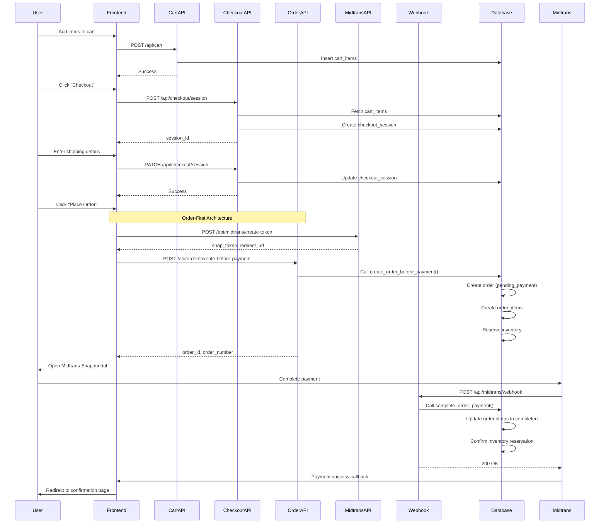
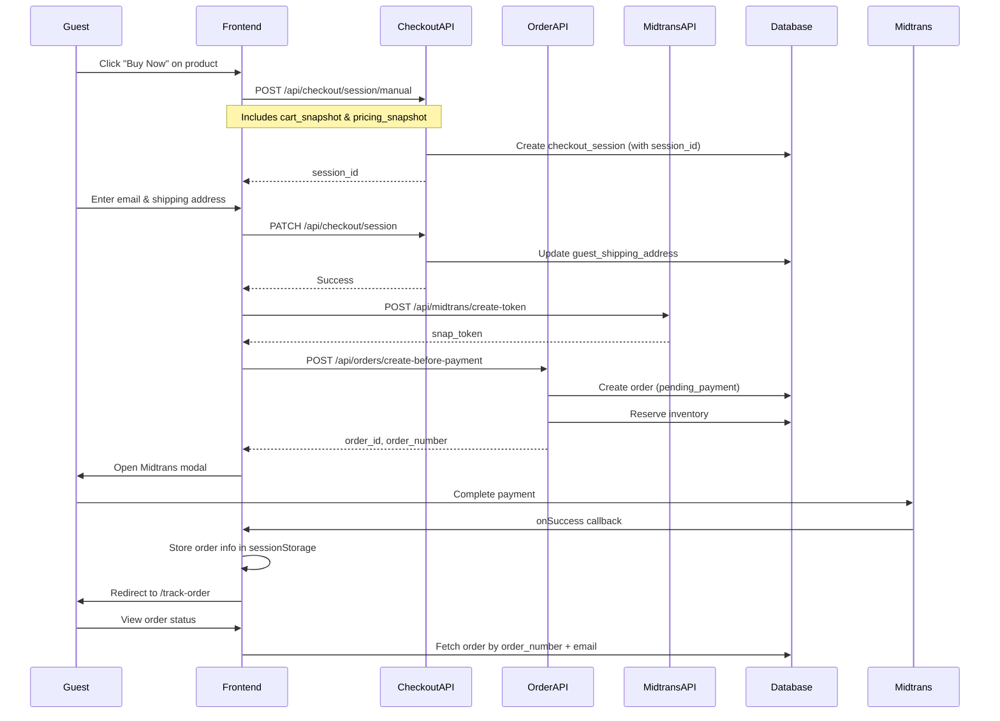

# Mykonos E-Commerce API Documentation

## Table of Contents
1. [Overview](#overview)
2. [Authentication](#authentication)
3. [Cart Management](#cart-management)
4. [Checkout Flow](#checkout-flow)
5. [Order Management](#order-management)
6. [Payment Processing](#payment-processing)
7. [End-to-End Checkout Flow](#end-to-end-checkout-flow)

---

## Overview

The Mykonos API follows a **Order-First Architecture** where orders are created BEFORE payment is processed. This ensures inventory is reserved and prevents race conditions during checkout.

**Base URL**: `http://localhost:3000/api` (development)

**Architecture Principles**:
- Order-first: Create order → Generate payment token → Process payment
- Inventory reservation happens at order creation
- Duplicate order prevention for pending orders
- 24-hour order expiry for unpaid orders

---

## Authentication

Most endpoints require authentication via Supabase Auth. Include the auth token in the Authorization header:

```
Authorization: Bearer <supabase_access_token>
```

Guest checkout is supported for certain endpoints (marked as "Guest Allowed").

---

## Cart Management

### GET /api/cart
Get current user's cart items.

**Auth**: Required  
**Method**: GET

**Response**:
```json
{
  "items": [
    {
      "id": "uuid",
      "product_id": "uuid",
      "quantity": 2,
      "variant_sku": "SKU-001",
      "product": {
        "id": "uuid",
        "name": "Product Name",
        "price_usd": 50.00,
        "price_idr": 750000,
        "sale_price": 40.00
      }
    }
  ],
  "item_count": 2,
  "subtotal": 80.00
}
```

### POST /api/cart
Add item to cart.

**Auth**: Required  
**Method**: POST

**Request Body**:
```json
{
  "product_id": "uuid",
  "quantity": 1,
  "variant_name": "50ml",
  "variant_sku": "SKU-001"
}
```

**Response**:
```json
{
  "success": true,
  "cart_item_id": "uuid"
}
```

**Validations**:
- Stock availability check
- Min/max purchase quantity enforcement
- Variant validation if applicable

### DELETE /api/cart/[id]
Remove item from cart.

**Auth**: Required  
**Method**: DELETE  
**Params**: `id` - Cart item ID

---

## Checkout Flow

### 1. POST /api/checkout/session
Create a checkout session (for regular cart checkout).

**Auth**: Required  
**Method**: POST

**Request Body**:
```json
{
  "user_id": "uuid",
  "session_id": "session_uuid",
  "currency_code": "IDR",
  "region_code": "ID"
}
```

**Response**:
```json
{
  "session_id": "checkout_session_uuid",
  "expires_at": "2024-03-20T10:00:00Z"
}
```

**Process**:
1. Fetches cart items from database
2. Calculates pricing (subtotal, tax, shipping)
3. Creates checkout session with 24-hour expiry
4. Returns session ID for next steps

### 2. POST /api/checkout/session/manual
Create checkout session with provided cart data (for Buy Now flow).

**Auth**: Required (user_id) or Guest Allowed (session_id)  
**Method**: POST

**Request Body**:
```json
{
  "user_id": "uuid",
  "session_id": "session_uuid",
  "currency_code": "IDR",
  "region_code": "ID",
  "customer_email": "guest@example.com",
  "cart_snapshot": [
    {
      "product_id": "uuid",
      "quantity": 1,
      "variant_sku": "SKU-001",
      "price": 50000
    }
  ],
  "pricing_snapshot": {
    "subtotal": 50000,
    "shipping": 0,
    "tax": 5000,
    "total": 55000,
    "currency_code": "IDR"
  }
}
```

**Response**:
```json
{
  "session_id": "checkout_session_uuid",
  "expires_at": "2024-03-20T10:00:00Z"
}
```

**Use Cases**:
- Buy Now flow (skip cart)
- Guest checkout
- Direct product purchase

### 3. PATCH /api/checkout/session
Update checkout session with shipping/payment details.

**Auth**: Required  
**Method**: PATCH

**Request Body**:
```json
{
  "session_id": "checkout_session_uuid",
  "current_step": 2,
  "customer_email": "user@example.com",
  "shipping_address_id": "address_uuid",
  "shipping_method_id": "method_uuid",
  "payment_method_type": "midtrans"
}
```

**Response**:
```json
{
  "success": true
}
```

---

## Order Management

### POST /api/orders/create-before-payment
**[Order-First Architecture]** Create order BEFORE payment.

**Auth**: Required or Guest Allowed  
**Method**: POST

**Request Body**:
```json
{
  "checkout_session_id": "checkout_session_uuid",
  "snap_token": "midtrans_snap_token",
  "snap_redirect_url": "https://app.midtrans.com/snap/v2/...",
  "user_id": "uuid",
  "session_id": "session_uuid"
}
```

**Response**:
```json
{
  "order_id": "order_uuid",
  "order_number": "ORD-20240320-001",
  "snap_token": "midtrans_snap_token",
  "snap_redirect_url": "https://app.midtrans.com/snap/v2/...",
  "expiry_time": "2024-03-21T10:00:00Z",
  "total_amount": 55000,
  "is_existing": false
}
```

**Process**:
1. Checks for duplicate pending orders (same cart items)
2. Reuses existing order if found (prevents inventory abuse)
3. Creates new order with "pending_payment" status
4. Calls `create_order_before_payment` database function
5. Reserves inventory via `reserve_inventory_for_order`
6. Sets 24-hour expiry time

**Duplicate Prevention**:
- Compares cart items with existing pending orders
- Matches by user_id, session_id, or customer_email
- Reuses order if cart items are identical
- Creates new order if cart differs

### GET /api/orders/verify-payment/[id]
Manually verify payment status with Midtrans API.

**Auth**: Required (Admin)  
**Method**: GET  
**Params**: `id` - Order ID

**Response**:
```json
{
  "order_id": "order_uuid",
  "order_number": "ORD-20240320-001",
  "payment_status": "completed",
  "midtrans_status": "settlement",
  "verified": true,
  "updated": true,
  "message": "Payment verified and order updated"
}
```

**Use Cases**:
- Manual reconciliation
- Webhook failure recovery
- Payment status debugging

---

## Payment Processing

### POST /api/midtrans/create-token
Generate Midtrans Snap payment token.

**Auth**: Required or Guest Allowed  
**Method**: POST

**Request Body**:
```json
{
  "orderId": "ORD-20240320-001",
  "amount": 55000,
  "customerDetails": {
    "firstName": "John",
    "lastName": "Doe",
    "email": "john@example.com",
    "phone": "+628123456789"
  },
  "items": [
    {
      "id": "product_uuid",
      "name": "Product Name",
      "price": 50000,
      "quantity": 1
    }
  ]
}
```

**Response**:
```json
{
  "token": "snap_token_string",
  "redirectUrl": "https://app.midtrans.com/snap/v2/vtweb/..."
}
```

### GET /api/midtrans/callback
Handle Midtrans payment callback.

**Auth**: None (Public)  
**Method**: GET  
**Query Params**:
- `order_id`: Order number
- `status_code`: HTTP status code
- `transaction_status`: Payment status (capture, settlement, pending, deny, cancel, expire)

**Process**:
1. Finds order by order_number
2. Checks transaction_status
3. If successful (capture/settlement):
   - Calls `complete_order_payment` function
   - Updates order status to "completed"
   - Redirects to confirmation page
4. If pending:
   - Redirects to order details with pending info
5. If failed/cancelled:
   - Redirects to order details with failure info

**Redirect URLs**:
- Success: `/checkout/confirmation?order=ORD-20240320-001`
- Pending: `/account/orders/{order_id}?info=payment_pending`
- Failed: `/account/orders/{order_id}?info=payment_failed`

### POST /api/midtrans/webhook
Handle Midtrans server-to-server webhook notifications.

**Auth**: None (Verified via signature)  
**Method**: POST

**Webhook Payload** (from Midtrans):
```json
{
  "transaction_status": "settlement",
  "order_id": "ORD-20240320-001",
  "gross_amount": "55000.00",
  "signature_key": "hash_signature",
  "transaction_id": "midtrans_transaction_id"
}
```

**Process**:
1. Verifies signature using SHA512 hash
2. Validates order exists
3. Updates order payment status
4. Calls `complete_order_payment` function
5. Sends confirmation email (if configured)

**Security**:
- Signature verification required
- Server key validation
- Idempotent processing

---

## End-to-End Checkout Flow

### Scenario 1: Authenticated User - Regular Cart Checkout



### Scenario 2: Guest User - Buy Now Flow



### Step-by-Step Breakdown

#### Step 1: Cart Management (Optional for Buy Now)
```
POST /api/cart
→ Add items to cart
→ Validate stock & pricing
→ Return cart_item_id
```

#### Step 2: Create Checkout Session
```
POST /api/checkout/session (Regular)
OR
POST /api/checkout/session/manual (Buy Now/Guest)

→ Fetch/receive cart items
→ Calculate pricing (subtotal, tax, shipping)
→ Create checkout_session record
→ Return session_id
```

#### Step 3: Update Checkout Details
```
PATCH /api/checkout/session
→ Add customer_email
→ Add shipping_address_id or guest_shipping_address
→ Add shipping_method_id
→ Update pricing with shipping cost
```

#### Step 4: Generate Payment Token
```
POST /api/midtrans/create-token
→ Prepare transaction details
→ Call Midtrans Snap API
→ Return snap_token & redirect_url
```

#### Step 5: Create Order (Order-First)
```
POST /api/orders/create-before-payment
→ Check for duplicate pending orders
→ Create order with pending_payment status
→ Create order_items from cart_snapshot
→ Reserve inventory
→ Set 24-hour expiry
→ Return order_id & order_number
```

#### Step 6: Process Payment
```
Frontend opens Midtrans Snap modal
→ User completes payment
→ Midtrans sends webhook to /api/midtrans/webhook
→ Webhook verifies signature
→ Calls complete_order_payment()
→ Updates order status to completed
→ Confirms inventory reservation
```

#### Step 7: Confirmation
```
GET /api/midtrans/callback (redirect)
→ Verify payment status
→ Redirect to confirmation page
OR
Track order via /track-order page (guest)
```

---

## Database Functions

### create_order_before_payment
Creates order with pending payment status and reserves inventory.

**Parameters**:
- `p_checkout_session_id`: UUID
- `p_snap_token`: TEXT
- `p_snap_redirect_url`: TEXT
- `p_expiry_time`: TIMESTAMP

**Returns**: UUID (order_id)

**Process**:
1. Fetches checkout session data
2. Creates order record (status: pending_payment)
3. Creates order_items from cart_snapshot
4. Calls `reserve_inventory_for_order(order_id)`
5. Returns order_id

### complete_order_payment
Completes order payment and confirms inventory reservation.

**Parameters**:
- `p_order_id`: UUID
- `p_payment_intent_id`: TEXT
- `p_transaction_status`: TEXT
- `p_gross_amount`: NUMERIC (optional)
- `p_currency`: TEXT (optional)

**Returns**: BOOLEAN

**Process**:
1. Updates order status to "completed"
2. Sets payment_status to "completed"
3. Records payment_intent_id
4. Confirms inventory reservation
5. Clears cart items (if user_id exists)

### reserve_inventory_for_order
Reserves inventory for order items.

**Parameters**:
- `p_order_id`: UUID

**Returns**: BOOLEAN

**Process**:
1. Fetches order items
2. For each item:
   - Decrements product stock_quantity
   - Creates inventory_reservation record
3. Validates sufficient stock

### find_pending_order
Finds existing pending order for user/session.

**Parameters**:
- `p_user_id`: UUID
- `p_session_id`: UUID
- `p_customer_email`: TEXT

**Returns**: UUID (order_id) or NULL

**Process**:
1. Searches for pending orders matching user_id, session_id, or email
2. Filters by payment_status = 'pending'
3. Filters by expiry_time > now()
4. Returns most recent match

---

## Error Handling

### Common Error Responses

**400 Bad Request**:
```json
{
  "error": "Cart is empty"
}
```

**401 Unauthorized**:
```json
{
  "error": "Unauthorized - Please refresh the page"
}
```

**404 Not Found**:
```json
{
  "error": "Order not found"
}
```

**500 Internal Server Error**:
```json
{
  "error": "Failed to create checkout session"
}
```

### Checkout-Specific Errors

- `Cart is empty`: No items in cart
- `Checkout session has expired`: Session older than 24 hours
- `Insufficient stock`: Product out of stock
- `Order already exists`: Duplicate order prevention
- `Payment verification failed`: Midtrans signature mismatch

---

## Best Practices

### For Frontend Developers

1. **Always create order before opening payment modal**
   ```typescript
   // ✅ Correct: Order-first
   const order = await createOrderBeforePayment()
   const token = await createMidtransToken(order)
   openPaymentModal(token)
   
   // ❌ Wrong: Payment-first
   const token = await createMidtransToken()
   openPaymentModal(token)
   const order = await createOrder() // Too late!
   ```

2. **Handle payment callbacks properly**
   ```typescript
   snap.pay(token, {
     onSuccess: (result) => {
       // Store order info in sessionStorage for guests
       sessionStorage.setItem('guestOrderInfo', JSON.stringify({
         orderNumber: order.order_number,
         email: customerEmail
       }))
       // Redirect to track-order page
       window.location.href = '/track-order'
     },
     onPending: (result) => {
       // Redirect to order details
       window.location.href = `/account/orders/${order.id}?info=pending`
     },
     onError: (result) => {
       // Show error message
       toast.error('Payment failed')
     }
   })
   ```

3. **Use sessionStorage for guest checkout**
   - Never expose order details in URL parameters
   - Store order_number and email in sessionStorage
   - Auto-fill track-order form on page load

4. **Implement proper loading states**
   - Show loading during order creation
   - Disable buttons during API calls
   - Handle network errors gracefully

### For Backend Developers

1. **Always validate inventory before order creation**
2. **Use database transactions for order creation**
3. **Implement idempotent webhook handlers**
4. **Log all payment-related events**
5. **Set appropriate order expiry times**
6. **Clean up expired orders via cron job**

---

## Testing

### Test Midtrans Payment

**Sandbox Credentials**:
- Server Key: `SB-Mid-server-...` (from env)
- Client Key: `SB-Mid-client-...` (from env)

**Test Cards**:
- Success: `4811 1111 1111 1114`
- Failure: `4911 1111 1111 1113`
- CVV: `123`
- Expiry: Any future date

### Test Scenarios

1. **Regular Checkout**:
   - Add items to cart
   - Proceed to checkout
   - Complete payment
   - Verify order created

2. **Buy Now Flow**:
   - Click Buy Now on product
   - Enter guest email
   - Complete payment
   - Track order

3. **Duplicate Order Prevention**:
   - Create order
   - Don't pay
   - Try to create same order again
   - Verify existing order is reused

4. **Order Expiry**:
   - Create order
   - Wait 24 hours
   - Verify order expires
   - Verify inventory released

---

## Monitoring & Debugging

### Key Logs to Monitor

```
🔵 [API] - API endpoint called
✅ [API] - Success
❌ [API] - Error
📥 [API] - Request received
📤 [API] - Response sent
🔍 [API] - Database query
💰 [API] - Pricing calculation
📝 [API] - Database write
```

### Common Issues

**Issue**: "Cart is empty" error
- **Cause**: Cart items not found for user/session
- **Solution**: Verify user_id or session_id is correct

**Issue**: "Order already exists" 
- **Cause**: Duplicate order prevention triggered
- **Solution**: This is expected behavior, use existing order

**Issue**: Payment webhook not received
- **Cause**: Midtrans webhook configuration
- **Solution**: Use manual verification endpoint

**Issue**: Inventory not reserved
- **Cause**: Order creation failed
- **Solution**: Check database logs for errors

---

## Rate Limiting

Currently no rate limiting implemented. Recommended limits:

- Cart operations: 100 requests/minute
- Checkout session: 10 requests/minute
- Order creation: 5 requests/minute
- Payment token: 10 requests/minute

---

## Changelog

### v1.0.0 (Current)
- Order-first architecture implementation
- Duplicate order prevention
- Guest checkout support
- Midtrans payment integration
- Manual payment verification
- 24-hour order expiry

---

## Support

For API issues or questions:
- Check logs in browser console and server logs
- Verify Midtrans configuration
- Test with sandbox credentials first
- Use manual verification endpoint for payment issues
